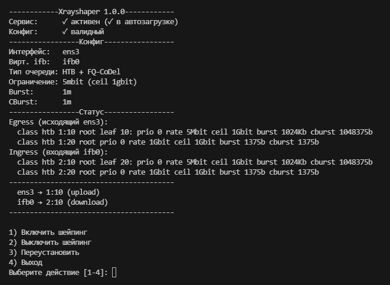

# Xrayshaper

Двусторонний fair-use лимитер-шейпер с контролем 95-го перцентиля (для широкого применения в быту и идеально подходящий для Xray/V2Ray прокси-сервера)
##### Ограничение входящего и исходящего соединения сервера по среднему значению - для удовлетворения условий некоторых fair-use VDS/VPS хостеров. Правильное распределение потоков по приоритету и равномерное распределение скорости между всеми потоками, при этом сохраняя отзывчивость конечных клиентов.



## Установка

```bash
curl -sL https://raw.githubusercontent.com/hydraponique/xrayshaper/main/xrayshaper.sh | sudo bash
```

## 🔥 Ключевые особенности

- **📊 Контроль 95-го перцентиля** - точное ограничение средней скорости через HTB
- **⚖️ Честное распределение** - FQ-CoDel для равномерного распределения между соединениями
- **🔁 Двусторонний контроль** - ограничение исходящего (upload) и входящего (download) трафика
- **🎯 Приоритет системного трафика** - SSH, DNS, NTP, ICMP и TCP ACK пакеты не ограничиваются
- **🤖 Автоматизация** - автоопределение интерфейсов, проверка зависимостей
- **🔧 Systemd интеграция** - автозагрузка и управление через systemd

## Использование

```bash
sudo xrayshaper             # Интерактивное меню
sudo xrayshaper on          # Включить шейпинг
sudo xrayshaper off         # Выключить шейпинг  
sudo xrayshaper status      # Статус системы
sudo xrayshaper reinstall   # Переустановка
```
### Приоритизация трафика

| Приоритет | Тип трафика | Порт/Протокол |
|-----------|-------------|----------------|
| 🟢 Высокий | Системный | SSH (22), DNS (53/853), NTP (123), ICMP |
| 🟢 Высокий | Сетевой | TCP ACK пакеты, локальные сети |
| 🟡 Ограниченный | Пользовательский | Весь остальной трафик (включая Xray) |

## Стек технологий
- **HTB (Hierarchical Token Bucket)** - точный контроль скорости
- **FQ-CoDel (Fair Queuing Controlled Delay)** - честное распределение и low latency
- **IFB (Intermediate Functional Block)** - двусторонний контроль
- **iptables** - маркировка и классификация трафика
- **tc (traffic control)** - настройка очередей

## Требования и зависимости

- **Ubuntu 18.04+/Debian 10+** (тестировалось на Ubuntu 24.04.3 LTS и Debian 12.11 Bookworm)
- **Linux kernel ≥ 5.15**

Все следующие зависимости присутствуют обычно по умолчанию в Debian-based GNU/Linux:
- iproute2 ≥ 6.0
- iptables
- systemd
- ifb - модуль ядра Linux из пакета linux-modules-extra
